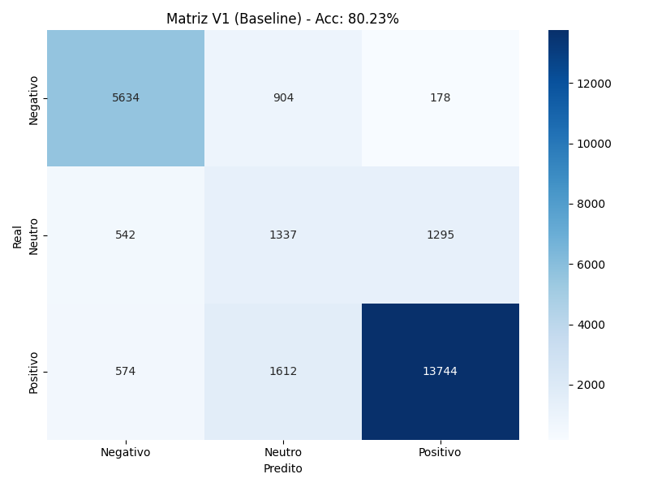
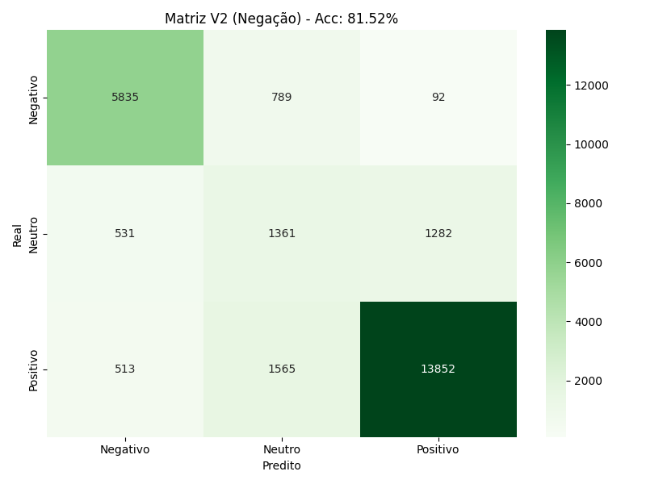
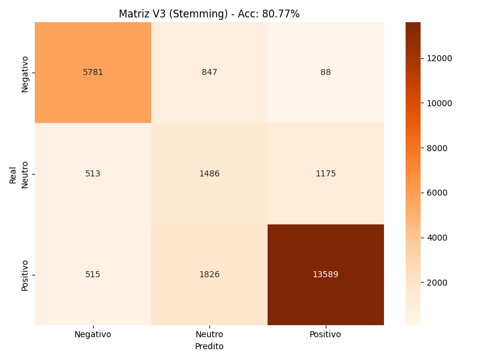
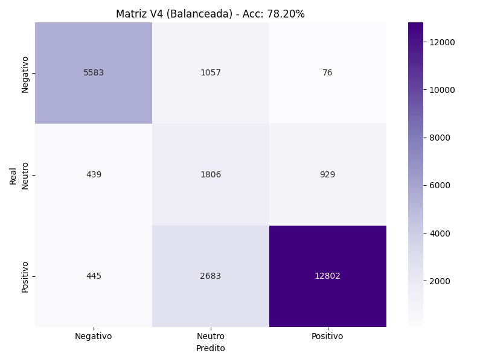
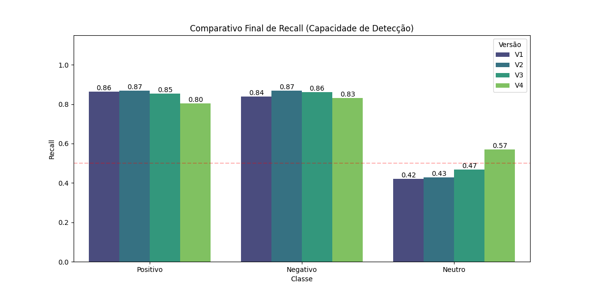

# Classificador de Sentimentos em E-commerce (Naive Bayes e Redes Bayesianas)

**Disciplina:** Introdução à Inteligência Artificial  
**Semestre:** 2025.2  
**Professor:** ANDRE LUIS FONSECA FAUSTINO  
**Turma:** T03

### Integrantes do Grupo

* Elielson Urbano Aires da Silva (20250024296)
* Jadilson Igor de Campos Lopes (20240034172)
* Wallyson Matheus Souza de Oliveira (20240046647)

---

### Descrição do Projeto

Este projeto consiste no desenvolvimento de um agente inteligente capaz de classificar automaticamente sentimentos (Positivo, Negativo ou Neutro) em avaliações de produtos de e-commerce. O objetivo principal é automatizar a triagem de feedback de clientes, permitindo identificar rapidamente críticas e elogios em grandes volumes de dados.

A solução implementa e compara quatro abordagens de Inteligência Artificial, utilizando Python e bibliotecas de Ciência de Dados. Partindo de um algoritmo **Naive Bayes Multinomial** clássico (Baseline), evoluímos a arquitetura para incorporar elementos de **Redes Bayesianas (Dependência Local)** através do tratamento de n-grams, corrigindo falhas críticas na detecção de negações (ex: "não gostei").

---

### Guia de Instalação e Execução

Siga os passos abaixo para configurar o ambiente e rodar o projeto na sua máquina local.

#### 1. Instalação das Dependências

Certifique-se de ter o **Python 3.8+** instalado.

1.  Clone este repositório (ou baixe a pasta):
    ```bash
    git clone [https://github.com/seu-usuario/analise-sentimentos-ia.git](https://github.com/seu-usuario/analise-sentimentos-ia.git)
    cd analise-sentimentos-ia
    ```

2.  Certifique-se de que o arquivo de dados `base-reviews-b2w.csv` esteja dentro da pasta `data/`.

3.  Instale as bibliotecas necessárias:
    ```bash
    pip install -r requirements.txt
    ```

#### 2. Como Executar

O projeto possui dois modos de execução:

**A. Análise Completa (Gráficos e Comparativos):**
Execute o script principal para treinar as 4 versões do modelo e gerar os gráficos comparativos de Recall e Matrizes de Confusão.
```bash
python src/main.py
```

**B. Modo Demonstração (Teste Interativo):**
Para testar o modelo campeão (V2) digitnado frases manualmente e vendo a classificação em tempo real:
```bash
python src/demo.py
```

## Estrutura dos Arquivos

  * `src/`: Código-fonte da aplicação.
  * `data/`: Datasets utilizado.
  * `assets/`: Matrizes de confusão geradas, e gráfico de comparação entre as versões dos treinamentos.

## Resultados e Demonstração

Abaixo estão os resultados obtidos com o Modelo V2 (Campeão):

Modelo v1:


Modelo v2:


Modelo v3:


Modelo v4:


Comparativo final de Recall:


* Arquivos disponíveis em `/assets`

## Referências

* **Dataset Original:** [B2W-Reviews01 - Americanas Tech (GitHub)](https://github.com/americanas-tech/b2w-reviews01)
    * *Fonte oficial do dataset de reviews de e-commerce brasileiro (B2W Digital).*
* **Laboratorio - Incerteza:** [Tutorial: Teorema de Bayes e Classificadores Naive Bayes em Python](https://colab.research.google.com/drive/10jBM5jBhjkFlNIONUmqWqdsBOn9iMQxw?usp=drive_open#scrollTo=ocJRdsY6_1h-)
    * *Aula da disciplina INTRODUÇÃO À INTELIGÊNCIA ARTIFICIAL, com tutorial de Teorema de Bayes e Classificadores Naive Bayes em Python*
* **Documentação Scikit-Learn:** [Working With Text Data](https://scikit-learn.org/stable/tutorial/text_analytics/working_with_text_data.html)
    * *Guia oficial sobre como aplicar Machine Learning em textos (Bag of Words, TF-IDF e Naive Bayes).*
* **Documentação NLTK:** [Natural Language Toolkit - RSLP Stemmer](https://www.nltk.org/_modules/nltk/stem/rslp.html)
    * *Documentação do algoritmo de radicalização específico para a língua portuguesa utilizado na V3.*